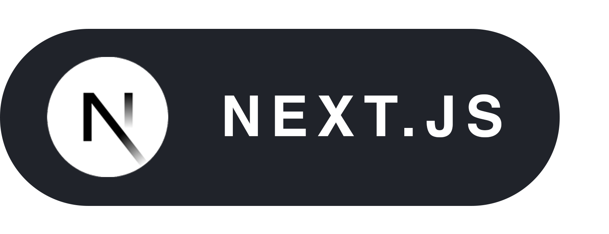
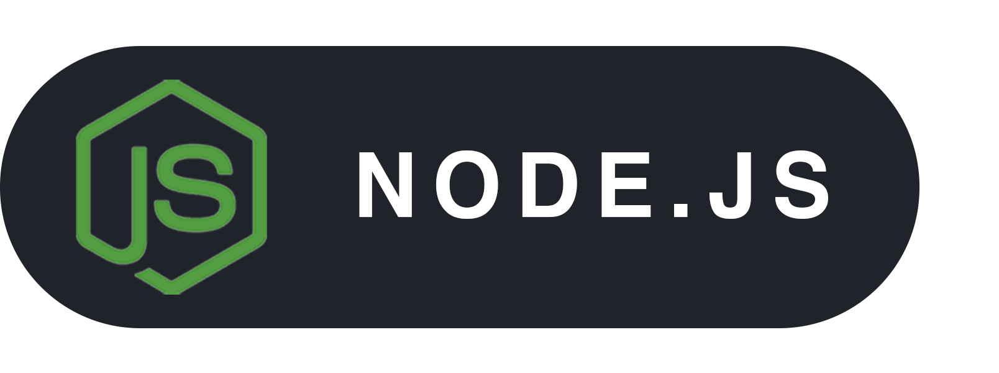
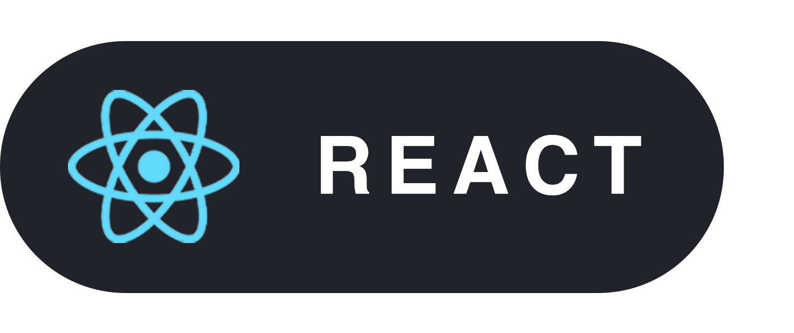
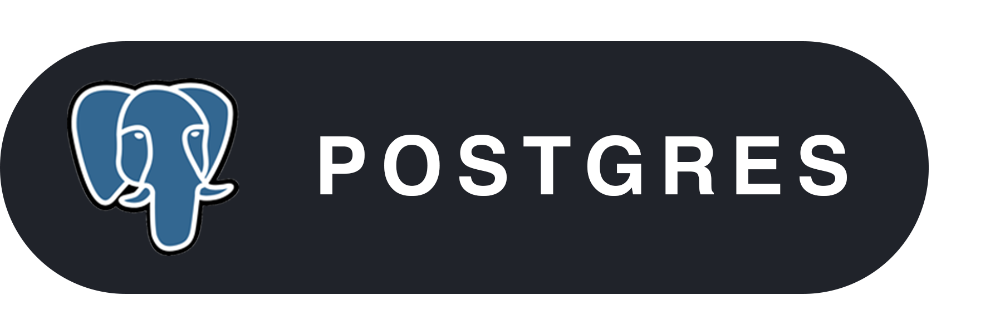
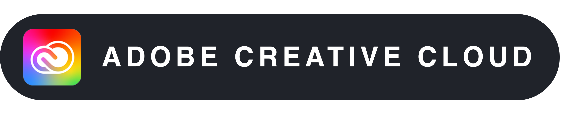
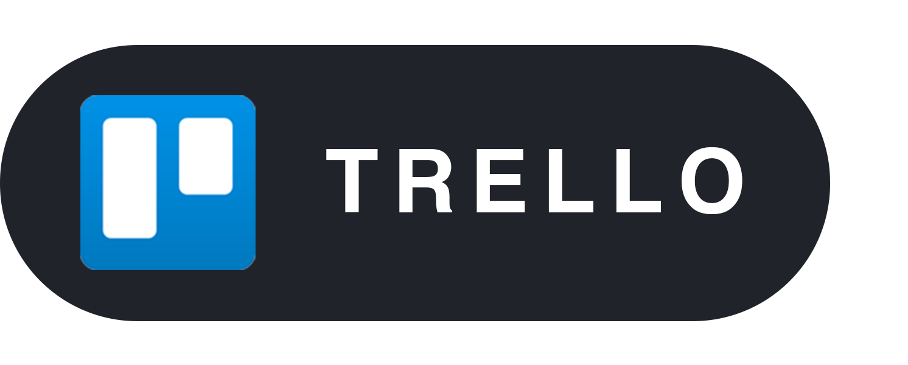

# Hey 👋🏾

👩🏾‍💻 I’m Lana! I have a background in Graphic Communication Design and am a proud student of the School of Code. I’m thrilled to embark on my journey in tech. 

✏️ My design expertise allows me to create visually compelling and user-centric digital experiences, while my coding skills, honed at the [School of Code](https://schoolofcode.co.uk/), empower me to tackle both front and back-end challenges.

I’m eager to leverage my design-driven perspective to build innovative and functional websites.

## Languages and Tools

  
  
  
  
  
  
  
  

## Let's connect! 🔗

<!--
**lanamauge/lanamauge** is a ✨ _special_ ✨ repository because its `README.md` (this file) appears on your GitHub profile.

Here are some ideas to get you started:

- 🔭 I’m currently working on ...
- 🌱 I’m currently learning ...
- 👯 I’m looking to collaborate on ...
- 🤔 I’m looking for help with ...
- 💬 Ask me about ...
- 📫 How to reach me: ...
- 😄 Pronouns: ...
- ⚡ Fun fact: ...

///////////////////////////////////////////////

  Hey 👋🏾

 
I’m Lana! I have a background in Graphic Communication Design and am a proud student of the School of Code, I’m thrilled to embark on my journey in tech.   
My design expertise allows me to create visually compelling and user-centric digital experiences, while my coding skills, honed at SOC, empower me to tackle both front and back-end challenges.   
I’m eager to leverage my design-driven perspective to build innovative and functional websites.

## Languages and Tools

  
  
  
  
  
  
  
  
  

## Let's connect! 🔗

-->
